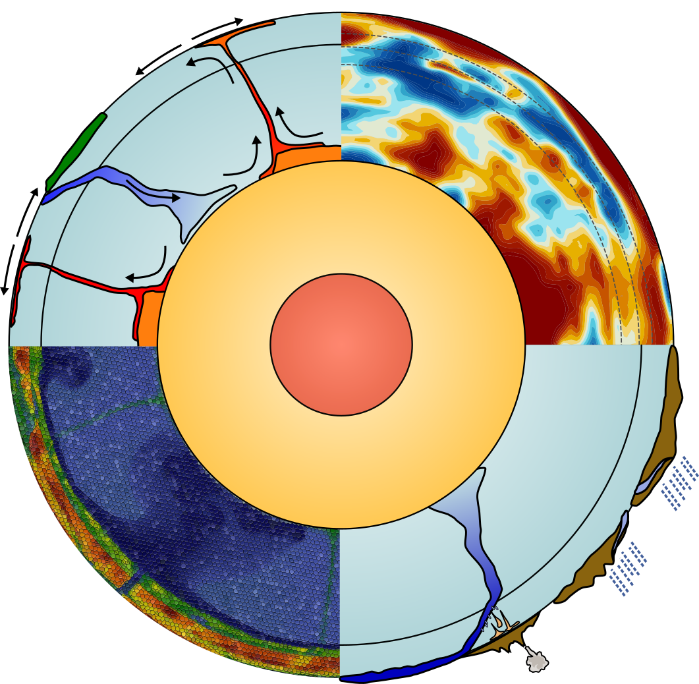

---
# Feel free to add content and custom Front Matter to this file.
# To modify the layout, see https://jekyllrb.com/docs/themes/#overriding-theme-defaults

layout: home
title: Integrated Geodynamic Earth Models
exclude: true
---

{:refdef: style="text-align: center;"}
{:width="250px"}
{: refdef}

## About

This is the project website for the [NSF sponsored project "Collaborative
Research: Development and Application of a Framework for Integrated Geodynamic
Earth Models"](https://www.nsf.gov/awardsearch/showAward?AWD_ID=1925595&HistoricalAwards=false).

The goal of the project is the creation of integrated geodynamic Earth models
to provide 3d reference states that include data from tomography models,
grain size estimation, and couple to surface processes. We are building
on the mantle convection code [ASPECT](https://aspect.geodynamics.org).

***
