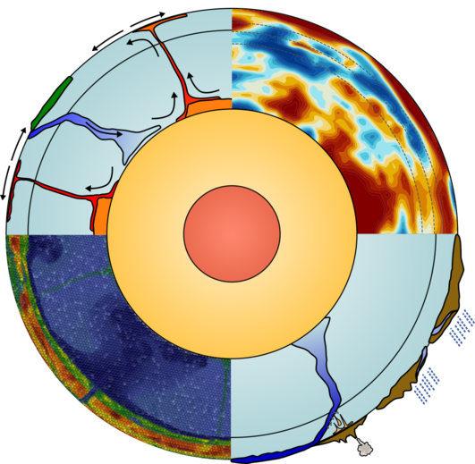

---
# Feel free to add content and custom Front Matter to this file.
# To modify the layout, see https://jekyllrb.com/docs/themes/#overriding-theme-defaults

layout: home
title: Integrated Geodynamic Earth Models
exclude: true
---

{:refdef: style="text-align: center;"}
{:width="250px"}
{: refdef}

## What we want to do

This is the project website for the NSF-sponsored project "[Collaborative
Research: Development and Application of a Framework for Integrated Geodynamic
Earth Models](https://www.nsf.gov/awardsearch/showAward?AWD_ID=1925595&HistoricalAwards=false)".

**_Mission:_** To create three-dimensional, integrated geodynamic
reference models for the Earth above the core-mantle boundary, that
can then be used for the accurate forward simulation of the Earth
state on time scales of millions of years.

**_Vision:_** For decades, Earth scientists have dreamed of building
computational simulators that can predict the motion of material
inside and on the surface of Earth on long time scales. To realize
this dream, we need to have an accurate characterization of Earth's
state today, including its temperature state, its chemical
composition, and other quantities such as concentrations of volatiles
and melt fractions as well as grain sizes. None of these quantities
are directly measurable in most of the Earth, but by integrating the
many data sources available today (e.g., from tomography models,
gravity data, MT data, and geochemical information), we can start to
build such a reference model. This project is about exactly this: To
build and disseminate such reference models, use them for
simulations in the mantle convection code
[ASPECT](https://aspect.geodynamics.org), and couple them to
simulators of surface processes.

## A longer description

For decades, the geosciences community has dreamed of and worked
towards building simulations that can resolve the time and length
scales of deformation patterns in the solid Earth observed both
globally and regionally. This includes the slow motion of rocks in the
Earth's deep interior, the motion of tectonic plates, and smaller
scale localized deformation in the interior of and at the boundaries
between these plates on time scales ranging from thousands to millions
of years. Until recently, neither the computational tools, nor the
requisite information about how rocks behave at the temperature and
pressures of the Earth's interior were available to allow such
simulations with reasonable accuracy. However, with recent advances in
the Earth sciences and computing, we are finally at a point where it
is possible to develop computational models of the Earth from the deep
mantle to surface. This project is aimed at developing a framework for
building a Geodynamic Earth Models, based on the widely used community
modeling code ASPECT that the PIs have been building for the past 8
years. These simulations have the potential to provide enormous
insight into a wide range of topics, including temporal and spatial
variations in the motion and deformation of tectonic plates, the flow
of magma and the cycling of water through the Earth's interior, the
structure of the deep Earth, and landscape evolution. All work will be
made available to other scientists through open source software and
data sets, including tutorials and documentation modules to help
others use this work in practice. In addition, the project will create
accessible images, videos, and more elaborate educational material
that will be shared with high school and early college students
through outreach events. Beyond that, the experience this project will
build by creating a complex, multi-physics simulation code running on
large leadership-level computing facilities is also important for
complex codes needed to address many other scientific grand
challenges, such as several of NSF's "Big Ideas".

This project is about the creation of an Integrated Geodynamic Earth
Model for the realistic simulation of the Earth from the core-mantle
boundary to the surface on time scales of thousands to millions of
years. It will address a series of long-standing questions regarding
the physical structure of the solid Earth, global and regional
deformation patterns, material cycles determined by plate boundaries,
and coupled surface evolution. Assimilation and processing of
geophysical data sets will generate a Starting Earth Model providing a
detailed description of the Earth's thermal-chemical-rheological state
from the surface to the core-mantle boundary. High-resolution global
simulations will use this detailed description of Earth's physical
state to determine how brittle and ductile rheology controls the
partitioning of deformation and fault interaction within observed
plate boundaries. Building on the Starting Earth Model and global
simulations, globally embedded regional simulations will allow it to
determine how rheological and buoyancy variations within the Western
USA control observed deformation patterns. In combination with fully
coupled two-phase fluid transport and reactions, the project will
employ globally-embedded regional simulations to estimate global rates
and magnitudes of volatile transport within subducting oceanic plates
and provide insight into plate boundary and deep mantle volatile flux
patterns. Additionally, the project will facilitate the coupling of
these simulations to landscape evolution models to determine how
surface processes modify temporal variations in subduction
dynamics. Finally, this project will lead to the development of new
tools for the visualization of these simulation results, and use them
for a variety of outreach activities.

***
